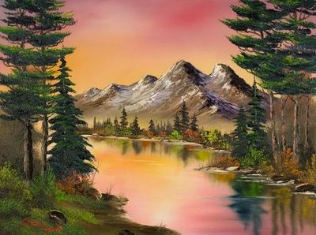
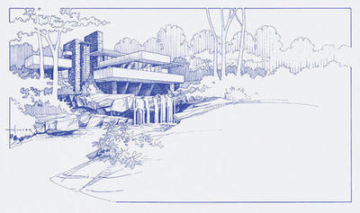
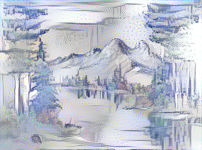

***

# Image style transfer

A system that takes an input image, style image and applies the style image to the content image, and thereby generates an interesting image.

## Dependencies

This work requires:

Python 3.6 and the following libraries installed:

* [Jupyter](http://jupyter.org/)
* [NumPy](http://www.numpy.org/)
* [Pandas](http://pandas.pydata.org/)
* [scikit-learn](http://scikit-learn.org/)
* [Scikit-image](https://scikit-image.org/)
* [keras](https://www.tensorflow.org/guide/keras)

These libraries can be installed using pip. To install the latest version of a package, use: pip install "package name"

Alternatively, install Anaconda distribution. This will install all the required libraries for this challenge including Jupyter notebooks. 

## Run Instructions

- Change to the Image style transfer directory in the unzipped folder. 

To apply the image style to a content image use the below command-line

python style_transfer.py

The input content image is an autumn mountain range, painted by Bob Ross the creator of Joy of Painting. The style image is an architectural drawing of Frank Lloyd Wright's Falling water. The output is after applying the style image to the input content image.

Sample content image, style image and the output image is shown below. 

## Project files

- The inputs directory has an example content image and style image.
- The Stayutils directory has neuralstyle.py python script which has NeuralStyle class implementation. 
- The style_transfer.py has settings which can be altered. Please change the content_weight, style_weight adn tv_weight and the number of iterations and see the result of the changes. 
- The bob_ross_final.png is the output image after style transfer.

## Future work

- This neural style transfer algorithm will work best with :

1. Content images that do not require high levels of detail to be either visually appealing or recognizable.

2. Style images that contain lot of texture. "Flat" style images will not produce aesthetically appealing results.

Finally, Please be sure to explore your parameter space with applying the neural style transfer algorithm. Vary your content weight, style weight, and total-variation weight will give you different results. Create a python script that iteratively runs 15-20 experiments with varying parameters so you can get a sense of what parameters (or maybe none at all) will generate aesthetically pleasing results for both your content image and style image.

